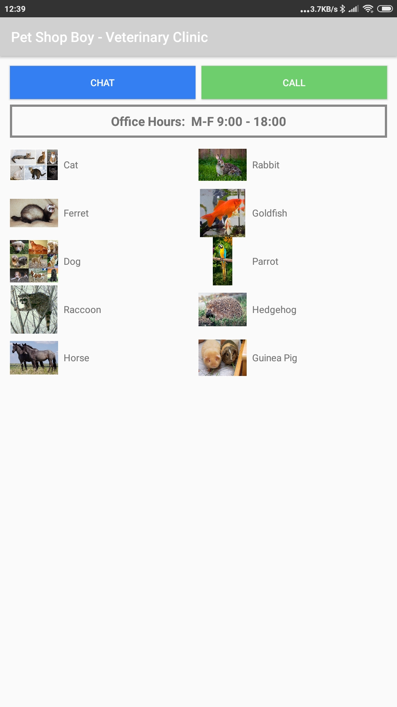
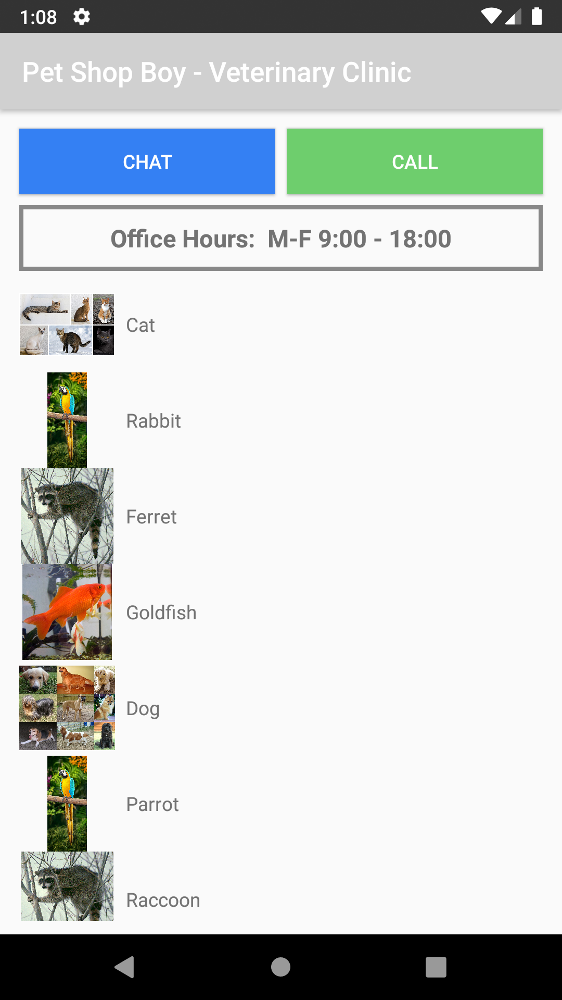

# Pet-Shop-Boy
Android app mimicking a pet shop built in a few days just for fun!
## Features
* Fetch and parse work hours from json stored online.
* Populate list of potential pets and display their Wikipedia page
* Responses from call/chat buttons depend on time
* UI adapts to very small screens where only images are diplayed to very large tablets where pet recommendations are shown in multiple columns.

## Known limitations
* Work Hours should not be 24 or larger Japanese style not supported
* Work Hours can only be week days, weekends are not supported
* config.json and pets.json  are not in valid json format.
* if network is unavailable while starting app, turn phone to reload UI when network is restored.

## Screenshot

